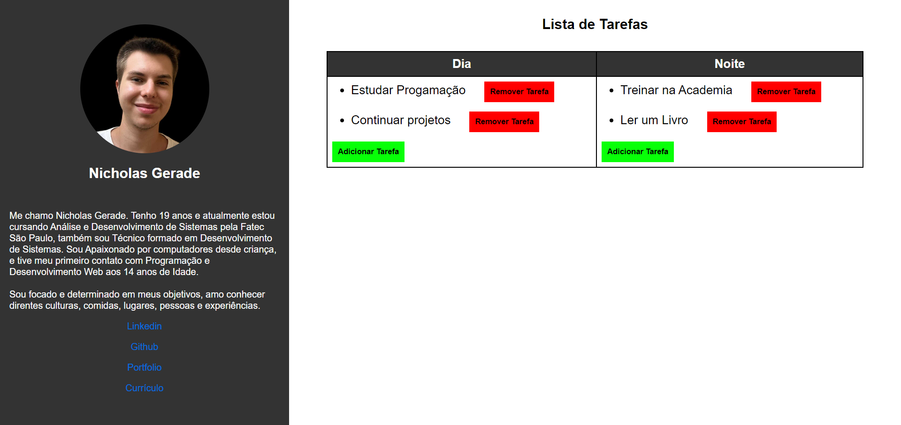

<h1 align="center">Projeto - Lista de Tarefas</h1>

Projeto de Lista de Tarefas criada como Desafio 2 como parte da 2° fase do Processo Seletivo para Aceleradora Ágil pela PUCRS

---

 

  

---
## 💻 Tecnologias

Esse projeto foi desenvolvido com as seguintes tecnologias:

- HTML5
- CSS3
- Javascript 
- Git e Github

---

## 🚧 Projeto

Você pode ver o site neste link: [Lista de Tarefas]()

--- 